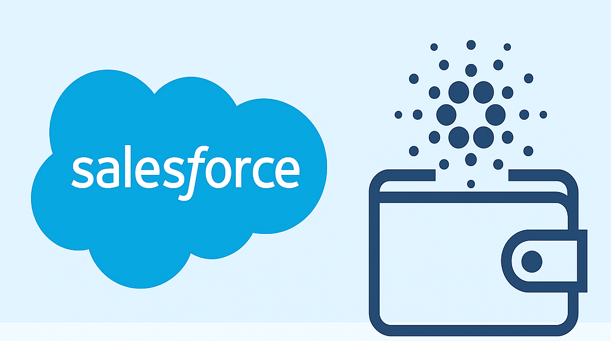

# ADA Wallet for Salesforce


The public repository for the Cardano Catalyst Fund 13 project

📖 **[User Guide: ADA Wallet for Salesforce Package Installation Guide and User Guide](documentation-and-images/ADA%20Wallet%20for%20Salesforce%20Admin%20Guide%2C%20Package%20Installation%20Guide%20and%20User%20Guide.pdf)** - Complete installation and user documentation

## Prerequisites

### Slack Integration Setup (Required for Notifications)

Before installing ADA Wallet for Salesforce, you must set up Slack integration for transaction notifications. Follow these steps:

#### 1. Pre-deployment Checklist
- Ensure you have administrator access to the org
- Navigate to **Setup → Slack Apps Setup**
- Read and accept the Terms & Conditions
- Toggle "Accepted" to On

#### 2. Enable Core Slack Features
- In Slack Apps Setup, click **Enable Slack Apps**
- Toggle **Sales Cloud for Slack** to On
- Complete the "I'm finished with this step" checklist

#### 3. Grant Required Permission Sets
- Go to **Setup → Users → [your user] → Permission Set Assignments**
- Click **Edit Assignments** and add:
  - ✅ **Sales Cloud for Slack**
  - ✅ **Slack Sales Home User**

#### 4. Install Salesforce for Slack App
- Return to **Setup → Slack Apps Setup**
- Complete step 6: **Install Slack Apps → Install Salesforce for Slack**

## Installation Instructions

ADA Wallet for Salesforce can be installed using two different methods depending on your needs and environment setup.

### Installation from Source (Development Setup)

This method is ideal for developers who want to work with the source code directly or need to customize the application.

1. Clone the repository
2. Check out the main branch
3. Log into the Dev Hub Org by running the command and entering your username and password
4. Create a Scratch Org by running the command with the following flags:
   - The `-f` flag is a path to config file (no need to change it)
   - The `-a` flag is an alias of the scratch org, if you create multiple scratch orgs you can give them unique aliases to easier refer to them
   - The `-d` flag marks the newly created scratch org as default. If you don't mark it as default you will have to reference it by username or alias, or you will have to use `sf config set target-org YourAliasOrUsername` to set is as default
   - The `-y` flag sets the number of days before the org expires
   - Use the `-h` flag for help
   - For more details: [developer docs scratch orgs create](https://developer.salesforce.com/docs/atlas.en-us.sfdx_dev.meta/sfdx_dev/sfdx_dev_scratch_orgs_create.htm)
5. Push the code to the Scratch Org
6. Connect to the Salesforce Scratch Org

### Installation from Salesforce Sandbox

This method is ideal for production deployments or when you want to install the managed package directly into your Salesforce environment.

**Demo Sandbox:** You can see the ADA Wallet for Salesforce package already installed and in use at: [https://catalystreview.my.salesforce.com](https://catalystreview.my.salesforce.com)

**Direct Installation Link:** You can install the package directly using this URL: [https://catalystreview.lightning.force.com/packaging/installPackage.apexp?p0=04tTO0000006W3dYAE](https://catalystreview.lightning.force.com/packaging/installPackage.apexp?p0=04tTO0000006W3dYAE)

**Demo Login Credentials:**
- Username: `spencer@web3enabler.com.catalyst`
- Password: `Xnz3A6vFDhL^pCCZ`

**Installation Steps:**
1. Navigate to your Salesforce sandbox or production org
2. Go to Setup → Package Manager
3. Click "Install a Package"
4. Enter the package ID: `04tTO0000006W3dYAE` (for version 0.1.0)
5. Follow the installation wizard
6. Grant access to third-party websites when prompted (cardano-mainnet.blockfrost.io)
7. Complete the installation process

## Setup Configuration

After connecting to your org, complete these essential configuration steps:

1. Add the Admin Permissions to this user `sf org assign permset --name Ada_Wallet_Admin_Managed`
2. Add the Seed Phrase permission set "ADA Wallet Seed Phrase And Wallet Keys" to users who need access to sensitive operations: `sf org assign permset --name Ada_Wallet_Seed_Phrase`
3. Navigate to the App Launcher (nine dots in top left) and open "Ada Wallet Setup"
4. Create the Organization Encryption Key:
   - This step is only visible to users with the "ADA Wallet Seed Phrase And Wallet Keys" permission set (`Ada_Wallet_Seed_Phrase`)
   - This key is used to decrypt sensitive wallet information for users who should have access
5. Set up Blockfrost Integration:
   - Visit [Blockfrost.io](https://blockfrost.io) to create a free account
   - Create a new project to get your Project ID
   - In the Ada Wallet Setup app, enter your Blockfrost Project ID to enable blockchain operations

## Development Workflow

To contribute to the ADA Wallet for Salesforce project, follow these steps:

1. **Fork the repository** on GitHub
2. **Clone your fork** locally
3. **Check out the develop branch** (or main if develop doesn't exist)
4. **Create a new feature branch** (e.g., `feature/mukn-123`)
5. **Make your changes** and test them in a scratch org
6. **Pull changes from Salesforce** using `sf project retrieve start`
7. **Commit and push** your changes to your fork
8. **Create a pull request** to the main repository

### Example Commands:
```bash
git checkout develop
git checkout -b feature/mukn-123
# Make your changes
sf project retrieve start
git add .
git commit -m "Add feature description"
git push origin feature/mukn-123
# Create pull request on GitHub
```

## Permission Sets and User Roles

The ADA Wallet for Salesforce implements a comprehensive permission system with four distinct permission sets to ensure proper access control and security:

### Business Critical Permission Sets

#### 1. Wallet Admin (`Ada_Wallet_Admin_Managed`)
**"Can do everything" - Full View/Modify All Access**
- ✅ Create Wallet Sets
- ✅ Create Wallets
- ✅ Use all Wallets (regardless of ownership)
- ✅ Full access to Lightning Web Components (LWC)
- ✅ Can create Transactions and Transaction Lines for any wallet
- ✅ View/Modify All Data access
- **Permission Set**: [Ada_Wallet_Admin_Managed](force-app/main/default/permissionsets/Ada_Wallet_Admin_Managed.permissionset-meta.xml)

#### 2. Wallet Manager (`Ada_Wallet_Manager_Managed`)
**"Can do everything except View/Modify All"**
- ✅ Create Wallet Sets
- ✅ Create Wallets
- ✅ Use Wallets owned by self or subordinates (role-based access)
- ✅ Access Lightning Web Components (LWC)
- ✅ Can create Transactions and Transaction Lines for permitted wallets
- ❌ No View/Modify All Data access
- **Permission Set**: [Ada_Wallet_Manager_Managed](force-app/main/default/permissionsets/Ada_Wallet_Manager_Managed.permissionset-meta.xml)

#### 3. Wallet User (`Ada_Wallet_Standard_User_Managed`)
**"Everything except CREATE Wallets/Wallet Sets"**
- ❌ Cannot create Wallet Sets
- ❌ Cannot create Wallets
- ✅ Use Wallets owned by self or subordinates (role-based access)
- ✅ Access Lightning Web Components (LWC)
- ✅ Can create Transactions and Transaction Lines for permitted wallets
- **Permission Set**: [Ada_Wallet_Standard_User_Managed](force-app/main/default/permissionsets/Ada_Wallet_Standard_User_Managed.permissionset-meta.xml)
- **Description**: This permission set provides access to use existing wallets and create transactions, but restricts the ability to create new Wallet Sets or Wallets. Users can only access wallets owned by themselves or subordinates based on organizational roles, and can create transactions and transaction lines for permitted wallets.

#### 4. ADA Wallet Seed Phrase and Wallet Keys (`Ada_Wallet_Seed_Phrase`)
**Dedicated permission set for sensitive operations**
- 🔐 Access to view and manage seed phrases
- 🔐 Access to view private keys
- 🔐 Required for organization encryption key management
- 🔐 Access to sensitive wallet operations
- **Permission Set**: [Ada_Wallet_Seed_Phrase](force-app/main/default/permissionsets/Ada_Wallet_Seed_Phrase.permissionset-meta.xml)

### Role-Based Access Control
The system implements role-based access control where users can only access wallets owned by themselves or users in subordinate roles. This ensures proper organizational hierarchy and data security.

## Key Features

### 1. Private Key Management

- **Component**: [Generate Seed Phrase](force-app/main/default/lwc/generateSeedPhrase)
- **Description**: Users can create a Wallet Set in their Org where they can generate a new seed phrase from scratch and verify it to create it. Only users with the "ADA Wallet Seed Phrase And Wallet Keys" permission set have access to decrypt and view the Seed Phrase.

### 2. Transaction Address Generation

- **Components**: 
  - [Create New Wallet](force-app/main/default/lwc/createNewWallet)
  - [UTXO Addresses](force-app/main/default/lwc/utxoAddresses)
- **Description**: The Create Wallet Flow handles deriving UTXO Addresses and generating the private and public keys for the wallet for a specific account path using an already created Wallet Set directly from the Seed Phrase. The UTXO component shows all derived UTXO addresses for both receiving and change addresses and the ability to derive new ones if needed.

### 3. Transaction Sending

- **Component**: [Wallet](force-app/main/default/lwc/wallet)
- **Description**: The wallet page enables users to send transactions by selecting all UTXOs that can be used in building the transactions and automatically calculates fees for sending.

### 4. Transaction Receiving

- **Component**: [Wallet](force-app/main/default/lwc/wallet)
- **Description**: Receiving transactions happens automatically by refreshing the page, which recalculates the total amount and assets in the wallet.

## Milestone 3

### Business Logic Enhancements

#### 1. Transaction Approval Workflow
- **Component**: Approval Process for Outbound Transactions
- **Description**: Implemented a comprehensive approval workflow system for outbound transactions. Users can now configure transaction approval requirements through the Ada Wallet Setup, enabling organizations to maintain control over outgoing ADA transfers.

#### 2. Slack Integration for Notifications
- **Component**: Slack Notification Flows
- **Description**: Added real-time Slack notifications for both incoming and outgoing transactions. Organizations can configure Slack workspace settings to receive instant alerts when transactions are received or sent, improving transparency and monitoring capabilities.

#### 3. Enhanced Transaction Management
- **Components**: 
  - [Outbound Transaction Object](force-app/main/default/objects/Outbound_Transaction__c) with approval tracking
  - [Inbound Transaction Object](force-app/main/default/objects/Inbound_Transaction__c) with detailed blockchain data
  - [UTXO Asset tracking](force-app/main/default/objects/UTXO_Asset__c) and management
- **Description**: Comprehensive transaction tracking system that captures detailed information including block height, block time, transaction fees, and asset details. All transactions are now properly categorized and stored with full audit trails.

#### 4. Advanced Security Features
- **Component**: [Encrypted Data Service](force-app/main/default/classes/EncryptedDataService.cls)
- **Description**: Enhanced security implementation with proper encryption/decryption services for sensitive wallet data. Private keys and seed phrases are now securely encrypted at rest and only accessible to authorized users with appropriate permissions.

#### 5. Automated Asset Discovery
- **Component**: [UTXO Address Asset Retrieval](force-app/main/default/lwc/getUTXOAddressAssets)
- **Description**: Automated system for discovering and tracking all assets (ADA and native tokens) associated with wallet addresses. Users can now easily view their complete asset portfolio including native Cardano tokens.

## Outbound Transaction Structure & Flow

The ADA Wallet uses a two-object structure to manage outbound blockchain transactions with built-in approval workflows and automation capabilities.

### Transaction Architecture

#### Transaction Object
Represents the overall blockchain transaction, including:
- Transaction status and lifecycle tracking
- Total amount and fee calculations
- Signed transaction data (CBOR format)
- Approval status and workflow state
- **Object**: [Outbound Transaction](force-app/main/default/objects/Outbound_Transaction__c)

#### Transaction Lines Object
Each line defines:
- Recipient address
- Amount to send
- Optional metadata and asset information
- Multiple lines can be included in a single transaction
- **Object**: [Outbound Transaction Lines](force-app/main/default/objects/Outbound_Transaction_Line__c)

### Transaction Lifecycle

The transaction follows a multi-step lifecycle with approval integration:

1. **New** – Created via app logic (LWC, Flow, or Apex)
2. **Prepared** – All lines are added and the transaction is marked ready to build
3. **Pending Approval** – Approval workflow is triggered (when enabled)
4. **Ready to Sign** – Triggered automatically when prepared and approved
5. **Ready to Send** – The signed transaction is added by the front end
   - *Note: This step requires the Lightning Web Component (LWC) to perform the signing. It cannot be bypassed or handled by Apex or automation.*
   - **Component**: [Prepare and Sign Transaction](force-app/main/default/lwc/prepareAndSignTransaction) - Handles transaction building and signing process
6. **Sent** – Trigger sends the transaction to the blockchain (via Blockfrost)
   - **Trigger**: [Outbound Transaction Trigger](force-app/main/default/triggers/OutboundTransactionTrigger.trigger)
   - **Handler**: [Outbound Transaction Trigger Handler](force-app/main/default/classes/OutboundTransactionTriggerHandler.cls)
7. **Confirmed** – Status is updated when the transaction is confirmed on-chain

### Approval Methodology

The system uses Salesforce Flow and Approval processes to manage outbound transaction authorization.

#### Approval Fields

**Approved (Picklist)**
- Not Approved
- Approval Requested
- Approved

**Status (Transaction Status)**
- Additional values: Pending Approval, Rejected

#### Flow and Approval process Logic

1. When a transaction is marked **Prepared**, it moves to **Pending Approval** instead of **Ready to Sign**
2. The system sets `Approved = "Approval Requested"` and launches an Flow which call the Approval process
3. After review:
   - **If approved**: `Approved = "Approved"`, `Status = "Ready to Sign"`
   - **If rejected**: `Approved = "Not Approved"`, `Status = "Rejected"`

#### Optional Enablement

- Approvals are **disabled by default**
- To enable: check the checkbox On the Setup page

### Slack Integration Setup

#### Pre-deployment Steps
1. Go to **Setup → Slack Apps Setup → Agree to Terms and conditions**
2. **Enable Slack Apps → Turn on Sales Cloud for Slack**
3. **Setup → Users → Choose your user → Permission set assignments → Assign 2 permission sets**:
   - Sales Cloud for Slack
   - Slack Sales Home User
4. **Setup → Slack Apps Setup → Install Slack Apps - Install Salesforce for Slack**
5. In your Slack workspace: **Salesforce for Slack → Manage org connections → Connect new org**

#### Post-deployment Steps
**Setup → Custom settings → Slack Settings → Manage → New**
Populate:
- Slack app Id
- Slack channel Id
- Slack workspace Id

### Available Flows

#### 1. Slack on Receiving a Transaction
Automatically sends a Slack notification when a new Inbound Transaction record is created. The flow queries the Slack Settings custom setting to get the configured channel ID and workspace details, then posts a formatted message containing transaction details (amount, sender address, block information) to the designated Slack channel. This provides real-time visibility to the team when funds are received.

**Component**: Flow triggered by Inbound Transaction creation
- **Flow**: [Slack notification on receiving transaction](force-app/main/default/flows/Slack_notification_on_receiving_transaction.flow-meta.xml)
- **Custom Setting**: [Slack Settings](force-app/main/default/objects/Slacksettings__c)
**Implementation Notes:**
- Sends a Slack message when an inbound transaction is received
- Uses a globally configured Channel ID stored in Setup
- Slack app integration may require selecting which Salesforce-Slack connector is active
- Note: If the selected Slack app requires it, a Lightning Web Component (LWC) may be needed to complete the handshake or send the message

#### 2. Slack on Sending a Transaction
Sends a Slack notification when an Outbound Transaction is successfully submitted to the blockchain. The flow uses the same Slack Settings configuration as the receiving flow and posts transaction details including recipient addresses, amounts, and transaction hash. This ensures the team is notified of all outgoing transactions for audit and monitoring purposes.

**Component**: Flow triggered by Outbound Transaction status change to "Sent"
- **Flow**: [Slack notification on sending transaction](force-app/main/default/flows/Slack_notification_on_sending_transaction.flow-meta.xml)
**Implementation Notes:**
- Sends a Slack message when a transaction is successfully sent
- Shares infrastructure with the receiving Slack flow
- Also uses the globally configured Channel ID
- May require Slack App and LWC support, depending on the version used

#### 3. Request Approval via Slack for a Transaction
Routes approval requests through Slack instead of traditional email notifications. The flow identifies the appropriate approver based on the transaction amount or organizational hierarchy, then sends a direct message or channel notification with transaction details and approval/denial buttons. When the approver responds via Slack, the flow updates the Outbound Transaction's approval status and moves it to the next lifecycle stage.

**Component**: Flow triggered when Outbound Transaction status changes to "Pending Approval"
- **Flow**: [Transaction approval triggered flow](force-app/main/default/flows/Transaction_approval_triggered_flow.flow-meta.xml)
**Implementation Notes:**
- Approval requests are routed through Slack instead of email
- Sent either as a direct message (DM) to the approver or to a designated Slack Channel, depending on what's easier to implement
- Uses the same Slack App infrastructure and may rely on an LWC to handle interaction

#### 4. Email Accounting on Sending a Transaction
Sends an email notification to the accounting contact configured in the organization's settings when a transaction is successfully sent. The flow includes transaction details such as amounts, fees, recipient information, and timestamps in a formatted email template. This provides accounting teams with immediate notification of financial transactions for record-keeping and reconciliation purposes.

**Component**: Flow triggered by Outbound Transaction status change to "Sent"
- **Flow**: [Slack notification on sending transaction](force-app/main/default/flows/Slack_notification_on_sending_transaction.flow-meta.xml)
**Implementation Notes:**
- Sends an email to the accounting contact configured in Setup
- Simple Flow logic and templated email format

#### 5. Emailing an Account Owner
Sends notification emails to the Wallet Set Owner associated with the transaction context. The flow includes relevant transaction details and can be configured to trigger on specific events (creation, approval, sending, etc.). This ensures account owners are kept informed of wallet activities related to their accounts.

**Component**: Flow triggered by Outbound Transaction creation or status changes
- **Flow**: [Slack notification on sending transaction](force-app/main/default/flows/Slack_notification_on_sending_transaction.flow-meta.xml)
**Implementation Notes:**
- Sends a notification email to the Account Owner linked to the transaction context
- If no account relationship exists, defaults to emailing the Wallet Owner
- Uses a simple, pre-built Flow and email template

## Additional resources

-   [Salesforce Extensions Documentation](https://developer.salesforce.com/tools/vscode/)
-   [Salesforce CLI Setup Guide](https://developer.salesforce.com/docs/atlas.en-us.sfdx_setup.meta/sfdx_setup/sfdx_setup_intro.htm)
-   [Salesforce DX Developer Guide](https://developer.salesforce.com/docs/atlas.en-us.sfdx_dev.meta/sfdx_dev/sfdx_dev_intro.htm)
-   [Salesforce CLI Command Reference](https://developer.salesforce.com/docs/atlas.en-us.sfdx_cli_reference.meta/sfdx_cli_reference/cli_reference.htm)
-   [Salesforce DX Project Configuration](https://developer.salesforce.com/docs/atlas.en-us.sfdx_dev.meta/sfdx_dev/sfdx_dev_ws_config.htm)

## Copyright and License

Copyright 2024 Web3 Enabler, Inc. ADA Wallet for Salesforce is distributed under the GPL license, version 3.0. For more information, see the [LICENSE](LICENSE) file.
