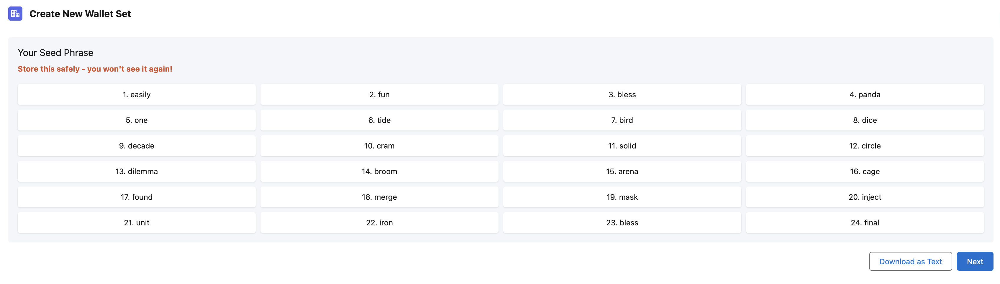
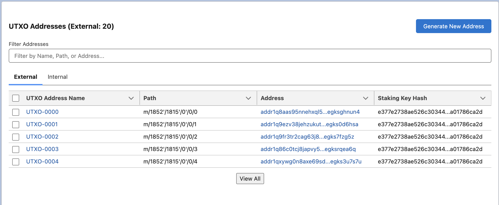
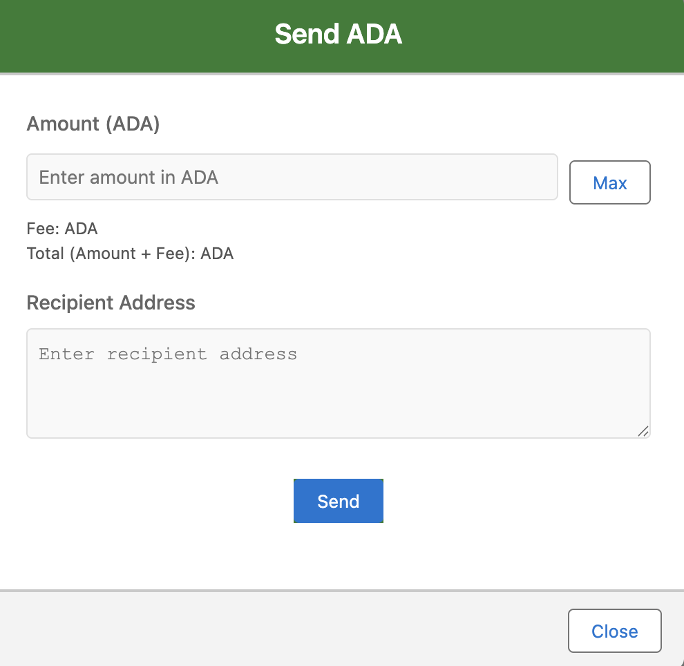
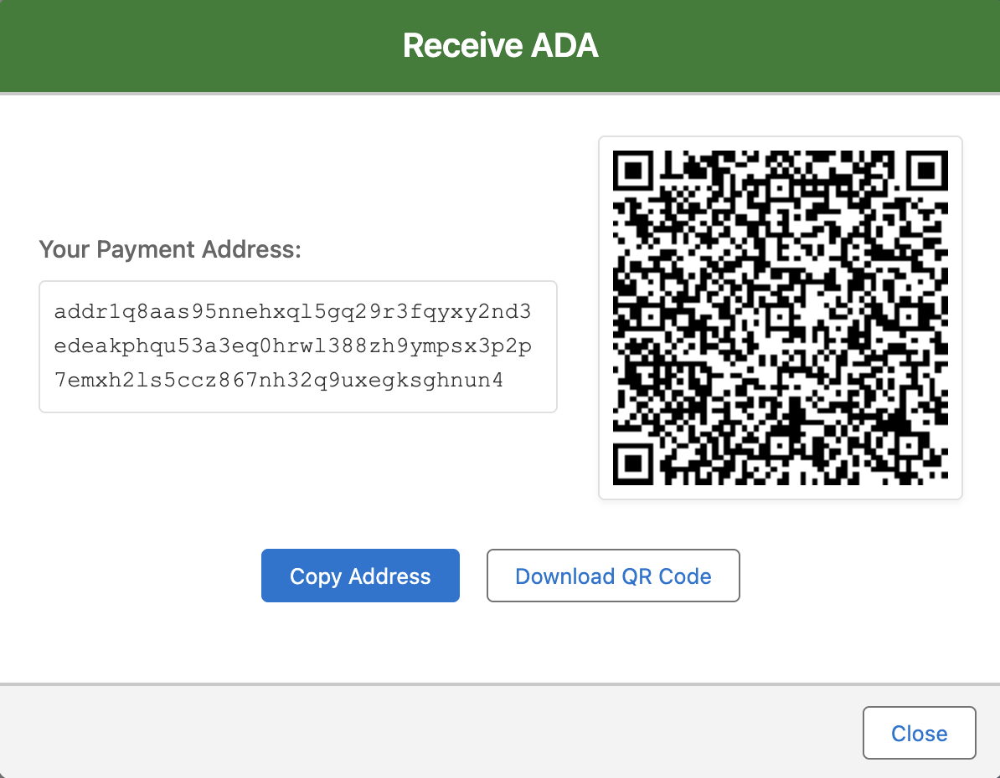

# ADA Wallet for Salesforce

The public repository for the Cardano Catalyst Fund 13 project

## Installation Instructions / How to Test the App

1. Clone the repository. `git clone https://github.com/MuKnSys/ada-wallet-for-salesforce.git`
2. Check out the main branch.
3. Log into the Dev Hub Org by running `sf org login web --set-default-dev-hub --alias DevHub --instance-url https://login.salesforce.com` and entering your username and password.
4. Create a Scratch Org by running `sf org create scratch -f ./config/project-scratch-def.json -a dev -d -y 30`.
* The `-f` flag is a path to config file (no need to change it).
* The `-a` flag is an alias of the scratch org, if you create multiple scratch orgs you can give them unique aliases to easier refer to them.
* The `-d` flag marks the newly created scratch org as default. If you don't mark it as default you will have to reference it by username or alias, or you will have to use `sf config set target-org YourAliasOrUsername` to set is as default.
* The `-y` flag sets the number of days before the org expires.
* Use the `-h` flag for help.
* For more details: [developer docs scratch orgs create](https://developer.salesforce.com/docs/atlas.en-us.sfdx_dev.meta/sfdx_dev/sfdx_dev_scratch_orgs_create.htm).
5. Push the code to the Scratch Org: `sf project deploy start`
6. Connect to the Salesforce Scratch Org: `sf org open`

## Setup Configuration

After connecting to your org, complete these essential configuration steps:

1. Add the Admin Permissions to this user `sf org assign permset --name Ada_Wallet_Admin_Managed`
2. Add the Seed Phrase permission set "ADA Wallet Seed Phrase And Wallet Keys" to users who need access to sensitive operations: `sf org assign permset --name Ada_Wallet_Seed_Phrase`
3. Navigate to the App Launcher (nine dots in top left) and open "Ada Wallet Setup"
4. Create the Organization Encryption Key:
   - This step is only visible to users with the "ADA Wallet Seed Phrase And Wallet Keys" permission set (`Ada_Wallet_Seed_Phrase`)
   - This key is used to decrypt sensitive wallet information for users who should have access
5. Set up Blockfrost Integration:
   - Visit [Blockfrost.io](https://blockfrost.io) to create a free account
   - Create a new project to get your Project ID
   - In the Ada Wallet Setup app, enter your Blockfrost Project ID to enable blockchain operations

## Key Features

### 1. Private Key Management

- **Component**: [Generate Seed Phrase](https://github.com/MuKnSys/ada-wallet-for-salesforce/tree/main/force-app/main/default/lwc/generateSeedPhrase)
- **Description**: Users can create a Wallet Set in their Org where they can generate a new seed phrase from scratch and verify it to create it. Only users with the "ADA Wallet Seed Phrase And Wallet Keys" permission set have access to decrypt and view the Seed Phrase.

### 2. Transaction Address Generation

- **Components**: 
  - [Create New Wallet](https://github.com/MuKnSys/ada-wallet-for-salesforce/tree/main/force-app/main/default/lwc/createNewWallet)
  - [UTXO Addresses](https://github.com/MuKnSys/ada-wallet-for-salesforce/tree/main/force-app/main/default/lwc/utxoAddresses)
- **Description**: The Create Wallet Flow handles deriving UTXO Addresses and generating the private and public keys for the wallet for a specific account path using an already created Wallet Set directly from the Seed Phrase. The UTXO component shows all derived UTXO addresses for both receiving and change addresses and the ability to derive new ones if needed.

### 3. Transaction Sending

- **Component**: [Wallet](https://github.com/MuKnSys/ada-wallet-for-salesforce/tree/main/force-app/main/default/lwc/wallet)
- **Description**: The wallet page enables users to send transactions by selecting all UTXOs that can be used in building the transactions and automatically calculates fees for sending.

### 4. Transaction Receiving

- **Component**: [Wallet](https://github.com/MuKnSys/ada-wallet-for-salesforce/tree/main/force-app/main/default/lwc/wallet)
- **Description**: Receiving transactions happens automatically by refreshing the page, which recalculates the total amount and assets in the wallet.

## Additional resources

-   [Salesforce Extensions Documentation](https://developer.salesforce.com/tools/vscode/)
-   [Salesforce CLI Setup Guide](https://developer.salesforce.com/docs/atlas.en-us.sfdx_setup.meta/sfdx_setup/sfdx_setup_intro.htm)
-   [Salesforce DX Developer Guide](https://developer.salesforce.com/docs/atlas.en-us.sfdx_dev.meta/sfdx_dev/sfdx_dev_intro.htm)
-   [Salesforce CLI Command Reference](https://developer.salesforce.com/docs/atlas.en-us.sfdx_cli_reference.meta/sfdx_cli_reference/cli_reference.htm)
-   [Salesforce DX Project Configuration](https://developer.salesforce.com/docs/atlas.en-us.sfdx_dev.meta/sfdx_dev/sfdx_dev_ws_config.htm)

## Copyright and License

Copyright 2024 Web3 Enabler, Inc. ADA Wallet for Salesforce is distributed under the GPL license, version 3.0. For more information, see the [LICENSE](LICENSE) file.
