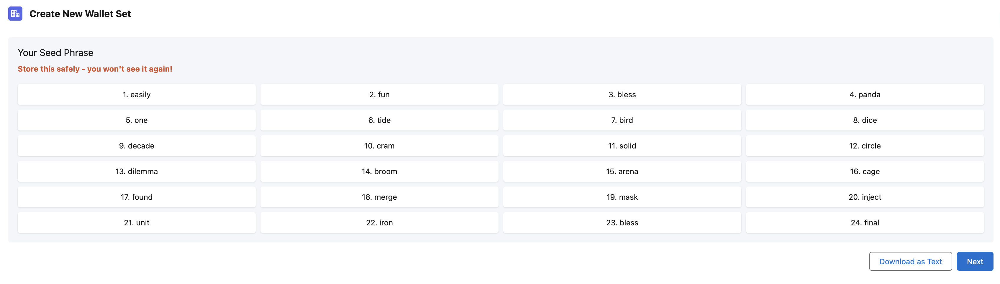
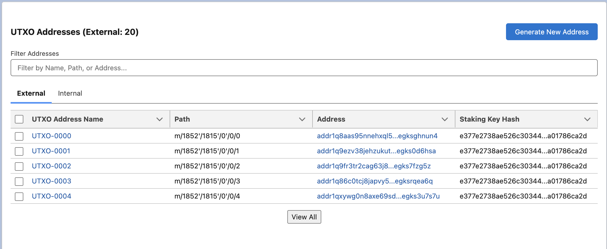
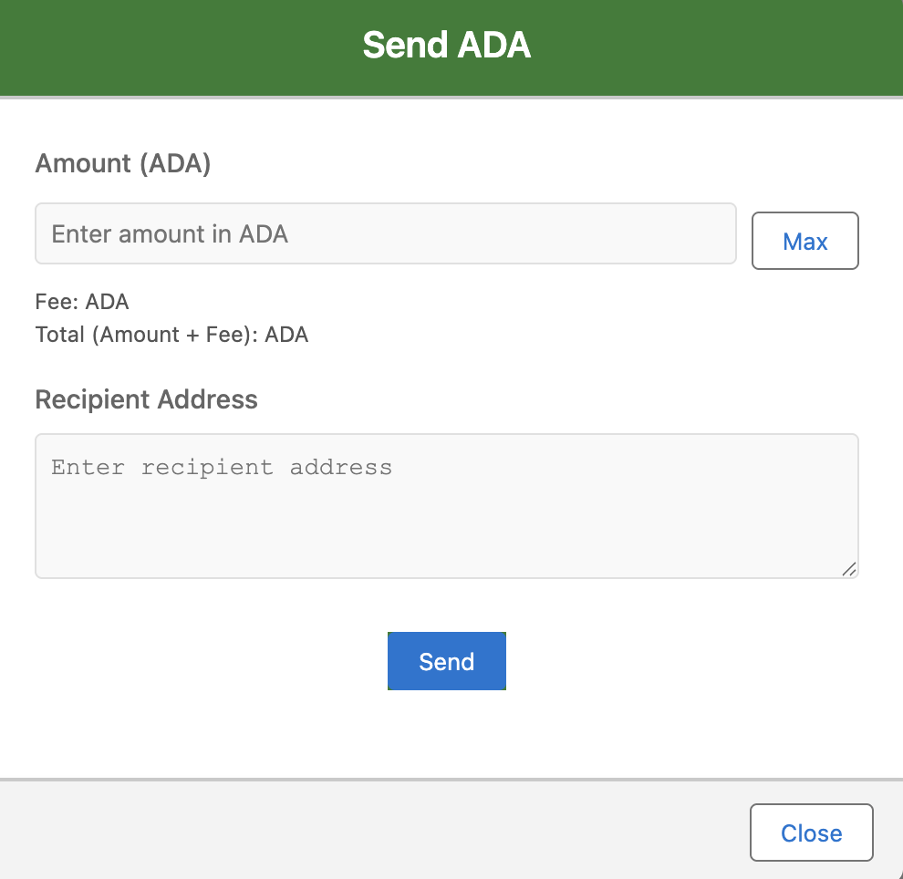
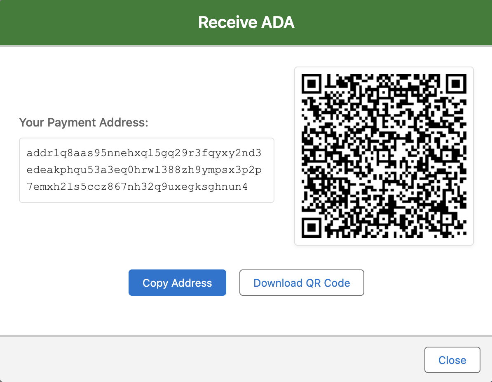

# ADA Wallet for Salesforce

## Development

1. **If you are not authorised to dev hub** run `sf org login web --set-default-dev-hub --alias DevHub --instance-url DevHubURL`
    - flag `--set-default-dev-hub` marks dev hub as default. If not set it will be required to provide dev hub in some commands like create scratch org
    - flag `--alias` is an alias of the org. You can set some friendly name so you can easily reference that org
    - flag `--instance-url` allows you to provide specific URL to log into in case you are authorised in multiple orgs
      \*\*If you are already logged in but need to update the Dev Hub, you can use sf config set target-dev-hub DevHub --global
1. Check out `develop` branch
1. Create a new `feature` branch e.g. `feature/mukn-123`
1. Create a scratch org by running `sf org create scratch -f ./config/project-scratch-def.json -a dev -d -y 30`
    - flag `-f` is a path to config file (no need to change it)
    - flag `-a` is an alias of the scratch org, if you create multiple scratch orgs you can give them unique aliases to easier refer to them
    - flag `-d` marks the newly created scratch org as default. If you don't mark it as default you will have to reference it by username or alias, or you will have to use `sf config set target-org YourAliasOrUsername` to set is as default
    - flag `-y` sets the number of days before org expires
    - use `-h` flag for help
1. Push code to newly created scratch org by using `sf project deploy start`
1. Add the Admin Permissions to this user `sf org assign permset --name Ada_Wallet_Admin_Managed`
1. Add the Seed Phrase permission set "ADA Wallet Seed Phrase And Wallet Keys" to users who need access to sensitive operations: `sf org assign permset --name Ada_Wallet_Seed_Phrase`
1. Connect into the Org: `sf org open`

## Post-Setup Configuration

After connecting to your org, complete these essential configuration steps:

1. Navigate to the App Launcher (nine dots in top left) and open "Ada Wallet Setup"
2. Create the Organization Encryption Key:
   - This step is only visible to users with the "ADA Wallet Seed Phrase And Wallet Keys" permission set (`Ada_Wallet_Seed_Phrase`)
   - This key is used to decrypt sensitive wallet information for users who should have access
3. Set up Blockfrost Integration:
   - Visit [Blockfrost.io](https://blockfrost.io) to create a free account
   - Create a new project to get your Project ID
   - In the Ada Wallet Setup app, enter your Blockfrost Project ID to enable blockchain operations

## Additional resources

-   [Salesforce Extensions Documentation](https://developer.salesforce.com/tools/vscode/)
-   [Salesforce CLI Setup Guide](https://developer.salesforce.com/docs/atlas.en-us.sfdx_setup.meta/sfdx_setup/sfdx_setup_intro.htm)
-   [Salesforce DX Developer Guide](https://developer.salesforce.com/docs/atlas.en-us.sfdx_dev.meta/sfdx_dev/sfdx_dev_intro.htm)
-   [Salesforce CLI Command Reference](https://developer.salesforce.com/docs/atlas.en-us.sfdx_cli_reference.meta/sfdx_cli_reference/cli_reference.htm)
-   [Salesforce DX Project Configuration](https://developer.salesforce.com/docs/atlas.en-us.sfdx_dev.meta/sfdx_dev/sfdx_dev_ws_config.htm)

## Key Features

### 1. Private Key Management

- **Component**: [Generate Seed Phrase](https://github.com/MuKnSys/ada-wallet-for-salesforce/tree/main/force-app/main/default/lwc/generateSeedPhrase)
- **Description**: Users can create a Wallet Set in their Org where they can generate a new seed phrase from scratch and verify it to create it. Only users with the "ADA Wallet Seed Phrase And Wallet Keys" permission set have access to decrypt and view the Seed Phrase.

### 2. Transaction Address Generation

- **Components**: 
  - [Create New Wallet](https://github.com/MuKnSys/ada-wallet-for-salesforce/tree/main/force-app/main/default/lwc/createNewWallet)
  - [UTXO Addresses](https://github.com/MuKnSys/ada-wallet-for-salesforce/tree/main/force-app/main/default/lwc/utxoAddresses)
- **Description**: The Create Wallet Flow handles deriving UTXO Addresses and generating the private and public keys for the wallet for a specific account path using an already created Wallet Set directly from the Seed Phrase. The UTXO component shows all derived UTXO addresses for both receiving and change addresses and the ability to derive new ones if needed.

### 3. Transaction Sending

- **Component**: [Wallet](https://github.com/MuKnSys/ada-wallet-for-salesforce/tree/main/force-app/main/default/lwc/wallet)
- **Description**: The wallet page enables users to send transactions by selecting all UTXOs that can be used in building the transactions and automatically calculates fees for sending.

### 4. Transaction Receiving

- **Component**: [Wallet](https://github.com/MuKnSys/ada-wallet-for-salesforce/tree/main/force-app/main/default/lwc/wallet)
- **Description**: Receiving transactions happens automatically by refreshing the page, which recalculates the total amount and assets in the wallet.
