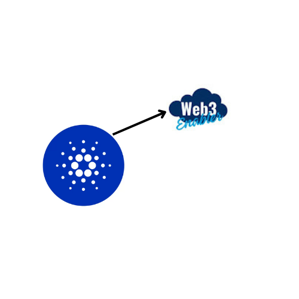

# ADA Wallet for Salesforce

ADA Wallet for Salesforce is an open source solution for using the Cardano Network to send payments, track payments, and otherwise manage a Cardano wallet 100% in Salesforce. This plugs into [ADA for Salesforce](https://cardano.ideascale.com/c/idea/126990), the transaction app, or can be run on its own.

## Copyright and License

Copyright 2024 Web3 Enabler, Inc.  ADA Wallet for Salesforce is distributed under the GPL licence, version 3.0.  For more information, see the [LICENSE file](LICENSE).
